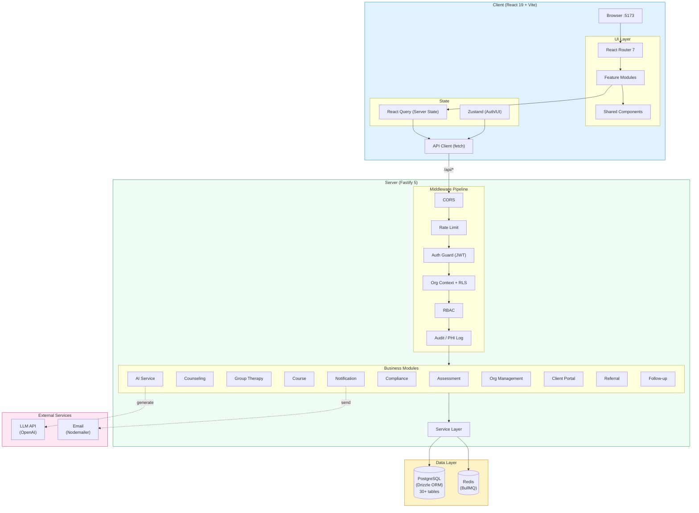
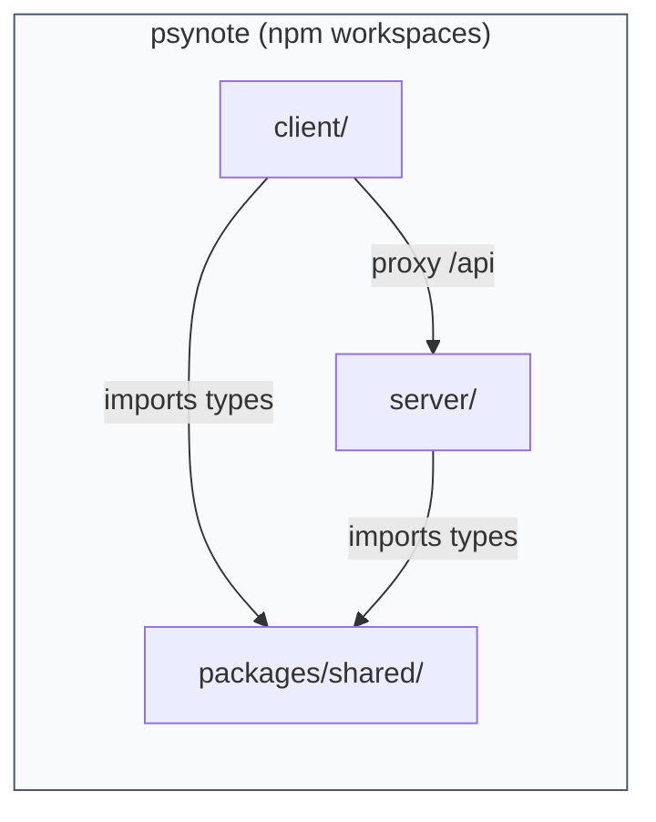
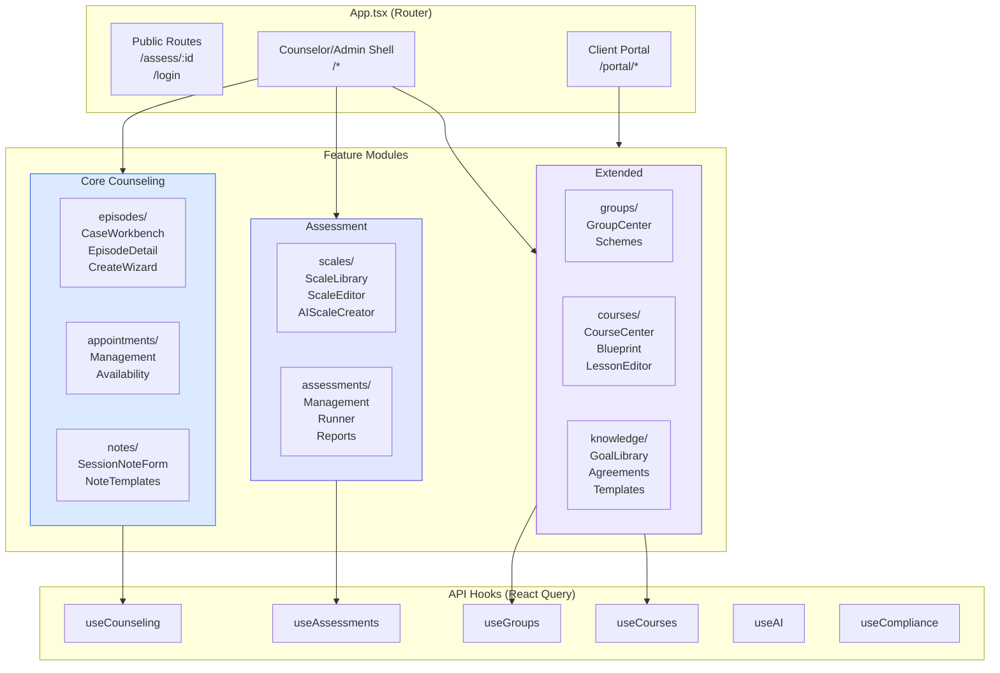
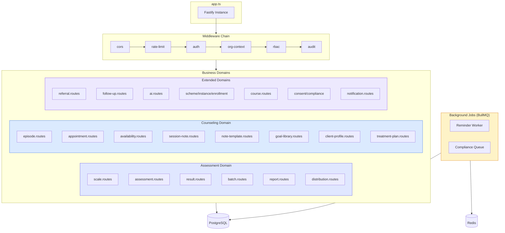
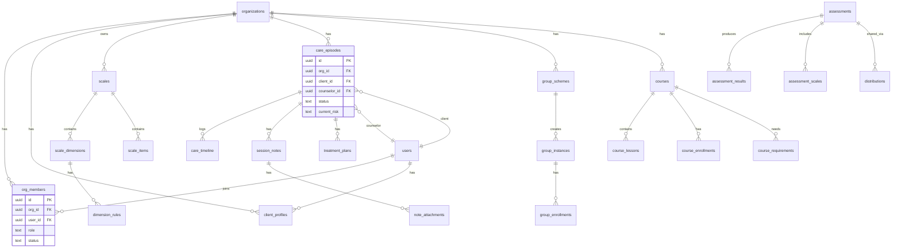
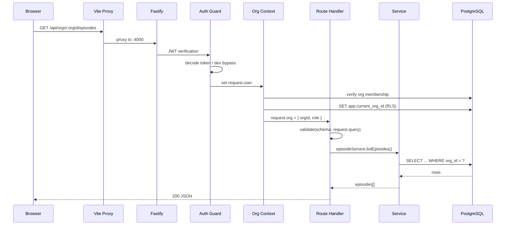

# Psynote Architecture

## System Overview

## Monorepo Structure

## Client Feature Architecture

## Server Module Architecture

## Database Schema (Core Tables)

## Request Flow

## Tech Stack Summary

| Layer | Technology |
|-------|-----------|
| Language | TypeScript 5.8 (strict) |
| Frontend | React 19, React Router 7, Vite 6 |
| State | Zustand (client), React Query (server) |
| Styling | Tailwind CSS 3.4 |
| Backend | Fastify 5 |
| ORM | Drizzle ORM (PostgreSQL) |
| Auth | 自建 JWT (bcrypt + jsonwebtoken) |
| Validation | Zod |
| Jobs | BullMQ (Redis) |
| AI | OpenAI API (configurable) |
| Monorepo | npm workspaces |
